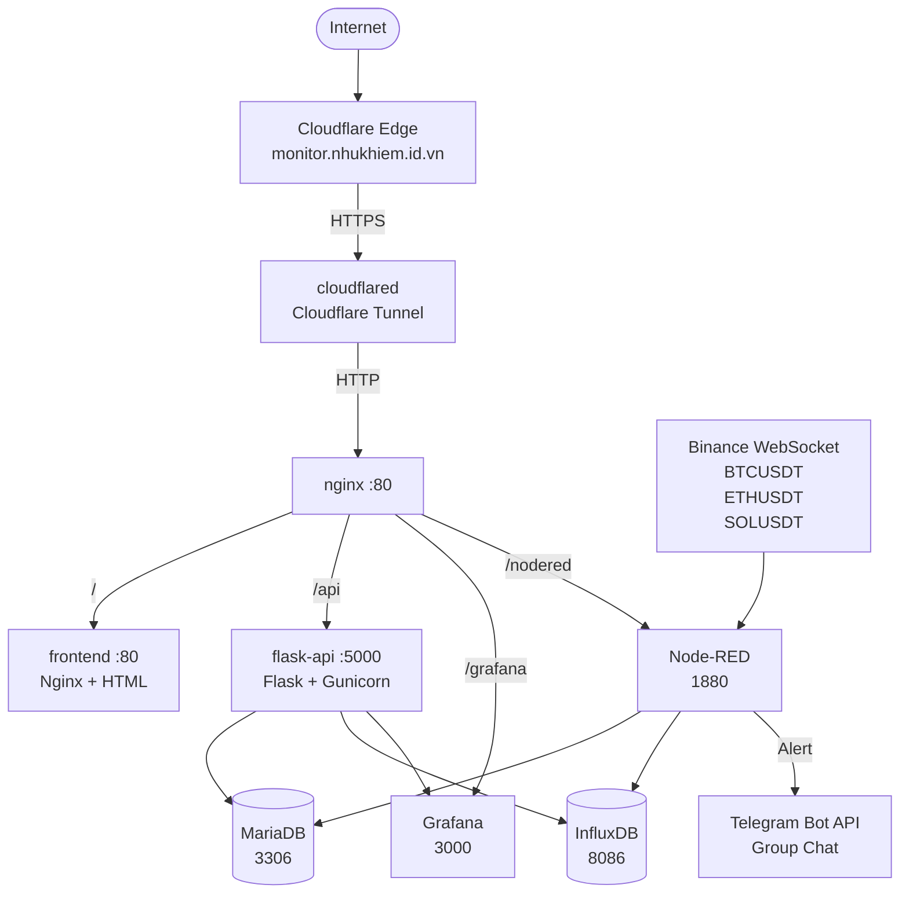

# 🚀 Crypto Monitor & Alert System

<div align="center">


**Hệ thống theo dõi giá crypto realtime với cảnh báo tự động qua Telegram**

</div>

---

# 📌 MỤC LỤC

1. [Lý thuyết Docker](#1-lý-thuyết-docker)
   - [Docker là gì?](#11-docker-là-gì)
   - [Các keyword trong docker-compose.yml](#12-các-keyword-trong-docker-composeyml)
   - [Ưu điểm khi triển khai app bằng Docker](#13-ưu-điểm-khi-triển-khai-app-bằng-docker)
   - [Triển khai lên máy chủ không có Internet](#14-triển-khai-lên-máy-chủ-không-có-internet)
2. [Tổng quan hệ thống](#2-tổng-quan-hệ-thống)
3. [Kiến trúc hệ thống](#3-kiến-trúc-hệ-thống)
4. [Yêu cầu hệ thống](#4-yêu-cầu-hệ-thống)
5. [Cấu trúc thư mục](#5-cấu-trúc-thư-mục)
6. [Cấu hình chi tiết từng service](#6-cấu-hình-chi-tiết-từng-service)
7. [Hướng dẫn cài đặt & chạy](#7-hướng-dẫn-cài-đặt--chạy)
8. [Cấu hình Node-RED](#8-cấu-hình-node-red)
9. [Cấu hình Grafana](#9-cấu-hình-grafana)
10. [Cấu hình Telegram Alert Bot](#10-cấu-hình-telegram-alert-bot)
11. [Logic cảnh báo bất thường](#11-logic-cảnh-báo-bất-thường)
12. [Triển khai offline lên máy chủ thật](#12-triển-khai-offline-lên-máy-chủ-thật)
13. [Troubleshooting](#13-troubleshooting)

---

# 1. LÝ THUYẾT DOCKER

## 1.1 Docker là gì?

**Docker** là nền tảng mã nguồn mở cho phép đóng gói ứng dụng cùng toàn bộ dependencies (thư viện, cấu hình, môi trường chạy) vào một đơn vị gọi là **container**.

> 📦 Hãy tưởng tượng container như một chiếc hộp vận chuyển chuẩn hoá — bất kể nội dung bên trong là gì, nó luôn chạy đúng ở mọi nơi có Docker.

**Các khái niệm cốt lõi:**

| Khái niệm | Mô tả |
|-----------|-------|
| **Image** | Bản thiết kế (blueprint) của container — chỉ đọc, được tạo từ `Dockerfile` |
| **Container** | Một instance đang chạy của image — có thể start, stop, delete |
| **Dockerfile** | File script định nghĩa cách build một image |
| **Registry** | Kho lưu trữ image — Docker Hub là registry công khai phổ biến nhất |
| **Volume** | Cơ chế lưu trữ dữ liệu bền vững, tồn tại khi container bị xoá |
| **Network** | Mạng ảo nội bộ kết nối các container với nhau |
| **Docker Compose** | Công cụ định nghĩa và quản lý nhiều container cùng lúc qua file YAML |

---

## 1.2 Các keyword trong `docker-compose.yml`

| Keyword          | Ý nghĩa                                     | Ví dụ                          |
| ---------------- | ------------------------------------------- | ------------------------------ |
| `version`        | Chỉ định phiên bản schema của Compose file  | `version: "3.8"`               |
| `services`       | Khối chứa định nghĩa các service/container  | `services: {web, db, api}`     |
| `image`          | Chỉ định Docker image dùng để tạo container | `image: nginx:latest`          |
| `build`          | Build image từ Dockerfile tùy chỉnh         | `build: ./flask-api`           |
| `container_name` | Đặt tên cố định cho container               | `container_name: crypto_api`   |
| `ports`          | Map cổng giữa host và container             | `"3000:3000"`                  |
| `environment`    | Khai báo biến môi trường cho container      | `MYSQL_ROOT_PASSWORD=root`     |
| `env_file`       | Nạp biến môi trường từ file `.env`          | `env_file: .env`               |
| `volumes`        | Lưu trữ dữ liệu hoặc mount thư mục từ host  | `db_data:/var/lib/mysql`       |
| `networks`       | Kết nối các container vào cùng mạng         | `networks: [backend_net]`      |
| `depends_on`     | Xác định thứ tự khởi động service           | `depends_on: [mariadb]`        |
| `healthcheck`    | Kiểm tra trạng thái hoạt động của container | `curl http://localhost/health` |
| `restart`        | Chính sách tự khởi động lại container       | `unless-stopped`               |
| `command`        | Ghi đè lệnh CMD mặc định của image          | `command: python app.py`       |
| `working_dir`    | Đặt thư mục làm việc trong container        | `working_dir: /app`            |
| `labels`         | Gắn metadata cho container                  | `com.example.role=api`         |
| `logging`        | Cấu hình lưu và xoay vòng log               | `max-size: 10m`                |
| `profiles`       | Nhóm service để khởi động theo nhu cầu      | `profiles: [debug]`            |

### Giá trị của `restart`

| Giá trị          | Ý nghĩa                             |
| ---------------- | ----------------------------------- |
| `no`             | Không tự khởi động lại              |
| `always`         | Luôn khởi động lại                  |
| `on-failure`     | Chỉ khởi động lại khi lỗi           |
| `unless-stopped` | Khởi động lại trừ khi dừng thủ công |

## 1.3 Ưu điểm khi triển khai ứng dụng bằng Docker

| Ưu điểm            | Mô tả                                                                        |
| ------------------ | ---------------------------------------------------------------------------- |
| ✅ Tính nhất quán   | Ứng dụng chạy giống nhau trên môi trường Development, Testing và Production  |
| ✅ Cô lập hoàn toàn | Mỗi service hoạt động độc lập, không xung đột thư viện hoặc dependency       |
| ✅ Triển khai nhanh | Chỉ cần `docker compose up -d` để khởi động toàn bộ hệ thống                 |
| ✅ Scale dễ dàng    | Tăng số lượng container bằng cách nhân bản service                           |
| ✅ Version control  | Dễ dàng quản lý và rollback phiên bản image                                  |
| ✅ Nhẹ hơn máy ảo   | Chia sẻ kernel với host nên tiêu tốn ít tài nguyên hơn VM                    |
| ✅ Hỗ trợ CI/CD     | Tích hợp thuận lợi với GitHub Actions, GitLab CI, Jenkins                    |
| ✅ Môi trường sạch  | Xóa container là loại bỏ toàn bộ môi trường chạy, không để lại cấu hình thừa |


---

### 1.4 Triển khai lên máy chủ không có Internet

> **Tình huống:** App chạy OK trên laptop → muốn deploy lên máy chủ thật, máy chủ **không có internet**.

<!-- [ẢNH: Sơ đồ luồng export → transfer → import] -->

#### Các bước thực hiện:

**Bước 1: Trên máy laptop (có internet) — Export images**

```bash
# Lưu tất cả images thành file .tar
docker save -o images_bundle.tar \
  nodered/node-red:latest \
  mariadb:10.11 \
  influxdb:2.7 \
  grafana/grafana:10.0.0 \
  nginx:alpine \
  python:3.11-slim

# Nén lại để giảm kích thước
tar -czf images_bundle.tar.gz images_bundle.tar
```

**Bước 2: Đóng gói toàn bộ source code và config**

```bash
tar -czf weather_app.tar.gz \
  docker-compose.yml \
  .env \
  nginx/ \
  flask-api/ \
  nodered-flows/ \
  grafana/
```

**Bước 3: Chuyển files sang máy chủ (USB / SCP nội bộ)**

```bash
scp images_bundle.tar.gz weather_app.tar.gz user@server-ip:/opt/weather/
```

**Bước 4: Trên máy chủ — Cài Docker (nếu chưa có, offline)**

```bash
# Download offline installer từ: https://download.docker.com/linux/static/stable/
tar xzf docker-25.x.x.tgz
sudo cp docker/* /usr/local/bin/
sudo dockerd &
```

**Bước 5: Import images vào Docker local**

```bash
cd /opt/weather/
gunzip images_bundle.tar.gz
docker load -i images_bundle.tar

# Kiểm tra images đã import thành công
docker images
```

**Bước 6: Giải nén project và chạy**

```bash
tar -xzf weather_app.tar.gz
cd weather_app/
cat .env                     # Kiểm tra cấu hình
docker compose up -d
docker compose ps
docker compose logs -f
```

**Bước 7: Kiểm tra hoạt động**

```bash
curl http://localhost:80        # Nginx frontend
curl http://localhost:1880      # Node-RED
curl http://localhost:3000      # Grafana
curl http://localhost:5000/api/weather  # Flask API
```

---


# 2. TỔNG QUAN HỆ THỐNG

**Luồng dữ liệu chính:**

---

## 📁 Cấu trúc thư mục

```
crypto-monitor/
├── docker-compose.yml          # Orchestration chính
├── .env                        # Biến môi trường (không commit)
├── .env.example                # Template .env
├── .gitignore
├── README.md
├── LICENSE
│
├── nginx/
│   ├── nginx.conf              # Nginx main config
│   └── conf.d/
│       └── default.conf        # Virtual host, reverse proxy
│
├── frontend/
│   ├── Dockerfile
│   ├── nginx-frontend.conf
│   └── index.html              # Single-page dark dashboard
│
├── flask-api/
│   ├── Dockerfile
│   ├── requirements.txt
│   └── app.py                  # REST API endpoints
│
├── mariadb/
│   └── init/
│       └── 01_init.sql         # Schema initialization
│
├── influxdb/                   # (config auto-generated)
│
├── grafana/
│   └── provisioning/
│       ├── datasources/
│       │   └── influxdb.yml    # Auto-configure datasource
│       └── dashboards/
│           ├── dashboard.yml
│           └── crypto-main.json # Pre-built dashboard
│
├── nodered/
│   └── flows.json              # Node-RED flow (Binance→DB→Telegram)
│
├── cloudflared/                # Tunnel config (nếu dùng file)
│
├── scripts/
│   ├── backup.sh               # Backup volumes
│   ├── restore.sh              # Restore volumes
│   ├── save-images.sh          # Export Docker images
│   └── load-images.sh          # Import Docker images
│
└── docs/
    └── screenshots/            # Ảnh minh chứng
```

---

## 🐳 Docker Compose – Giải thích chi tiết

| Service | Image | Port | Vai trò |
|---------|-------|------|---------|
| `mariadb` | mariadb:10.11 | 3306 (internal) | Lưu giá realtime + alert history |
| `influxdb` | influxdb:2.7 | 8086 (internal) | Time-series database lịch sử giá |
| `grafana` | grafana/grafana:10.4.2 | 3000 (internal) | Dashboard & biểu đồ |
| `nodered` | nodered/node-red:3.1.9 | 1880 (internal) | Thu thập Binance WS, xử lý, cảnh báo |
| `flask-api` | custom build | 5000 (internal) | REST API |
| `frontend` | custom build | 80 (internal) | Static web dashboard |
| `nginx` | nginx:1.25-alpine | **80:80** | Reverse proxy, entry point |
| `cloudflared` | cloudflare/cloudflared | — | Cloudflare Tunnel |

### Named Volumes

| Volume | Dữ liệu |
|--------|---------|
| `crypto-mariadb-data` | Database files MariaDB |
| `crypto-influxdb-data` | InfluxDB data |
| `crypto-influxdb-config` | InfluxDB config |
| `crypto-grafana-data` | Grafana dashboards, settings |
| `crypto-nodered-data` | Node-RED flows, settings |

---

## ⚙️ Hướng dẫn cài đặt

### Yêu cầu hệ thống

- Docker Engine >= 24.0
- Docker Compose >= 2.20
- RAM: tối thiểu 4GB
- Disk: tối thiểu 20GB

### Bước 1: Clone repository

```bash
git clone https://github.com/yourusername/crypto-monitor.git
cd crypto-monitor
```

### Bước 2: Cấu hình môi trường

```bash
cp .env.example .env
nano .env
```

Chỉnh sửa các giá trị bắt buộc:
```env
TELEGRAM_BOT_TOKEN=123456789:ABCdefGHIjklMNOpqrsTUVwxyz
TELEGRAM_CHAT_ID=-1001234567890
CLOUDFLARE_TUNNEL_TOKEN=your_tunnel_token_here
```

### Bước 3: Build và chạy

```bash
# Build các image custom
docker compose build

# Khởi động toàn bộ hệ thống
docker compose up -d

# Xem logs
docker compose logs -f
```

### Bước 4: Kiểm tra hệ thống

```bash
# Danh sách containers
docker compose ps

# Kiểm tra health
curl http://localhost/api/health
```

### Truy cập các dịch vụ

| Dịch vụ | URL | Credential |
|---------|-----|-----------|
| **Web Dashboard** | http://localhost | — |
| **Grafana** | http://localhost/grafana | admin / (xem .env) |
| **Node-RED** | http://localhost/nodered | — |
| **Flask API** | http://localhost/api/health | — |

---

## 🤖 Cấu hình Telegram Bot

### Bước 1: Tạo Bot

1. Mở Telegram, tìm `@BotFather`
2. Gửi `/newbot`
3. Đặt tên: `CryptoMonitorBot`
4. Đặt username: `your_crypto_monitor_bot`
5. Lưu **Bot Token** nhận được

### Bước 2: Tạo Group và thêm bot

1. Tạo Telegram Group mới
2. Thêm bot vào group
3. Thêm các member: Member 1, Member 2, User 1875746636

### Bước 3: Lấy Chat ID của Group

```bash
# Gửi một tin nhắn vào group, sau đó chạy:
curl "https://api.telegram.org/bot<YOUR_BOT_TOKEN>/getUpdates"
# Tìm "chat": {"id": -1001234567890, ...}
```

### Bước 4: Cập nhật .env

```env
TELEGRAM_BOT_TOKEN=123456789:ABCdefGHIjklMNOpqrsTUVwxyz
TELEGRAM_CHAT_ID=-1001234567890
```

### Mẫu tin nhắn alert

```
🔴 ALERT HIGH

Coin: BTCUSDT
Price: 120500 USD
Threshold: 120000 USD
Time: 2026-06-20 20:15:30
```

```
🔵 ALERT LOW

Coin: BTCUSDT
Price: 99500 USD
Threshold: 100000 USD
Time: 2026-06-20 20:15:30
```

---

## 📊 Hướng dẫn cấu hình Grafana

### Truy cập Grafana

```
URL: http://localhost/grafana
Username: admin
Password: (giá trị GRAFANA_ADMIN_PASSWORD trong .env)
```

### Datasource (tự động provisioned)

Datasource **InfluxDB-Crypto** đã được tự động cấu hình qua file `grafana/provisioning/datasources/influxdb.yml`.

Kiểm tra: **Configuration → Data Sources → InfluxDB-Crypto → Test**

### Dashboard

Dashboard **Crypto Monitor** (`uid: crypto-main`) đã được provisioned với 3 panels:
- BTC/USDT Price (line chart, màu vàng)
- ETH/USDT Price (line chart, màu xanh tím)
- SOL/USDT Price (line chart, màu tím)

### Cấu hình iframe trong frontend

Dashboard được nhúng vào frontend qua iframe:
```
http://<host>:3000/d/crypto-main/crypto-monitor?orgId=1&refresh=5s&from=now-1h&to=now&theme=dark&kiosk
```

Để cho phép embedding, đã cấu hình trong docker-compose.yml:
```yaml
GF_SECURITY_ALLOW_EMBEDDING: "true"
GF_AUTH_ANONYMOUS_ENABLED: "true"
GF_AUTH_ANONYMOUS_ORG_ROLE: Viewer
```

---

## 🔄 Hướng dẫn Node-RED

### Truy cập

```
URL: http://localhost/nodered
```

### Cài đặt nodes cần thiết

Trong Node-RED UI → **Manage palette → Install**:

```
node-red-node-mysql
node-red-contrib-influxdb
```

### Import flow

1. Vào Node-RED → **Menu (≡) → Import**
2. Chọn file `nodered/flows.json`
3. Click **Import**

### Cấu hình credentials

#### MariaDB node
- Host: `mariadb`
- Port: `3306`
- Database: `cryptodb`
- User: `cryptouser`
- Password: (từ .env)

#### InfluxDB node
- URL: `http://influxdb:8086`
- Token: (INFLUXDB_TOKEN từ .env)
- Organization: `cryptoorg`
- Bucket: `crypto_prices`

### Flow hoạt động

```
[Binance WS BTC] ──┐
[Binance WS ETH] ──┼──► [Parse] ──► [Check Threshold] ──► [Format Alert] ──► [Telegram]
[Binance WS SOL] ──┘         │                              │
                              ├──► [Save MariaDB]            └──► [Save Alert DB]
                              └──► [Save InfluxDB]
```

### Ngưỡng cảnh báo

| Coin | HIGH | LOW |
|------|------|-----|
| BTC  | > $120,000 | < $100,000 |
| ETH  | > $7,000 | < $4,000 |
| SOL  | > $300 | < $100 |

---

## ☁️ Hướng dẫn Cloudflare Tunnel

### Bước 1: Tạo Tunnel trên Cloudflare

1. Đăng nhập [dash.cloudflare.com](https://dash.cloudflare.com)
2. **Zero Trust → Access → Tunnels → Create a tunnel**
3. Đặt tên: `crypto-monitor`
4. Lấy **Tunnel Token**

### Bước 2: Cấu hình Public Hostname

| Subdomain | Domain | Service |
|-----------|--------|---------|
| `monitor` | `nhukhiem.id.vn` | `http://nginx:80` |

### Bước 3: Cập nhật .env

```env
CLOUDFLARE_TUNNEL_TOKEN=your_tunnel_token_here
```

### Bước 4: Khởi động lại

```bash
docker compose restart cloudflared
```

---

## 📡 API Documentation

Base URL: `http://localhost/api` hoặc `https://monitor.nhukhiem.id.vn/api`

### GET /api/health

Kiểm tra trạng thái hệ thống.

**Response:**
```json
{
  "status": "healthy",
  "checks": {
    "mariadb": "ok",
    "influxdb": "ok"
  },
  "timestamp": "2026-06-20T20:15:30.000Z"
}
```

---

### GET /api/prices

Lấy giá realtime tất cả coins từ MariaDB.

**Response:**
```json
{
  "status": "ok",
  "data": [
    {
      "symbol": "BTCUSDT",
      "price": 105234.56,
      "volume": 12345.67,
      "updated_at": "2026-06-20T20:15:30.000"
    }
  ],
  "timestamp": "2026-06-20T20:15:30.000Z"
}
```

---

### GET /api/prices/{symbol}

Lấy giá của một coin cụ thể.

**Path params:** `symbol` = `BTCUSDT` | `ETHUSDT` | `SOLUSDT`

**Response:**
```json
{
  "status": "ok",
  "data": {
    "symbol": "BTCUSDT",
    "price": 105234.56,
    "volume": 12345.67,
    "updated_at": "2026-06-20T20:15:30.000"
  }
}
```

---

### GET /api/history/{symbol}

Lấy lịch sử giá từ InfluxDB.

**Path params:** `symbol` = `BTCUSDT` | `ETHUSDT` | `SOLUSDT`

**Query params:** `range` = `5m` | `15m` | `1h` | `6h` | `24h` | `7d` (default: `1h`)

**Response:**
```json
{
  "status": "ok",
  "data": {
    "symbol": "BTCUSDT",
    "range": "1h",
    "records": [
      { "time": "2026-06-20T19:15:00+00:00", "price": 104980.00 }
    ]
  }
}
```

---

### GET /api/alerts

Lấy lịch sử cảnh báo.

**Query params:** `limit` = số lượng tối đa (default: 50, max: 200)

**Response:**
```json
{
  "status": "ok",
  "data": [
    {
      "id": 1,
      "symbol": "BTCUSDT",
      "alert_type": "HIGH",
      "price": 120500.00,
      "threshold": 120000.00,
      "triggered_at": "2026-06-20T20:15:30.000",
      "sent_ok": true
    }
  ]
}
```

---

### GET /api/system-status

Lấy trạng thái toàn bộ hệ thống.

**Response:**
```json
{
  "status": "ok",
  "data": {
    "mariadb":  { "status": "online", "records": 3 },
    "influxdb": { "status": "online" },
    "nodered":  { "status": "online" },
    "grafana":  { "status": "online" },
    "binance":  { "status": "online" }
  }
}
```

---

## 💾 Backup & Restore

### Export Docker Images (offline deployment)

```bash
# Script tự động
bash scripts/save-images.sh

# Hoặc thủ công
docker save nginx:1.25-alpine mariadb:10.11 influxdb:2.7 \
  grafana/grafana:10.4.2 nodered/node-red:3.1.9 \
  cloudflare/cloudflared:latest \
  -o crypto-images.tar

# Nén
gzip crypto-images.tar
# → crypto-images.tar.gz
```

### Import Docker Images (server offline)

```bash
# Copy qua USB/SCP
scp crypto-images.tar.gz user@server:/home/user/

# Trên server
gunzip crypto-images.tar.gz
docker load -i crypto-images.tar

# Build custom images
docker compose build --no-cache

# Chạy hệ thống
docker compose up -d
```

### Export Container (snapshot)

```bash
# Export container thành tar
docker export crypto-flask-api > flask-api-snapshot.tar

# Import thành image
docker import flask-api-snapshot.tar crypto-flask-api:backup
```

### Backup Volumes

```bash
# Backup MariaDB
docker run --rm \
  -v crypto-mariadb-data:/data \
  -v $(pwd)/backups:/backup \
  alpine tar czf /backup/mariadb-$(date +%Y%m%d_%H%M%S).tar.gz -C /data .

# Backup InfluxDB
docker run --rm \
  -v crypto-influxdb-data:/data \
  -v $(pwd)/backups:/backup \
  alpine tar czf /backup/influxdb-$(date +%Y%m%d_%H%M%S).tar.gz -C /data .

# Backup Grafana
docker run --rm \
  -v crypto-grafana-data:/data \
  -v $(pwd)/backups:/backup \
  alpine tar czf /backup/grafana-$(date +%Y%m%d_%H%M%S).tar.gz -C /data .

# Backup Node-RED
docker run --rm \
  -v crypto-nodered-data:/data \
  -v $(pwd)/backups:/backup \
  alpine tar czf /backup/nodered-$(date +%Y%m%d_%H%M%S).tar.gz -C /data .
```

### Restore Volumes

```bash
# Stop services
docker compose down

# Restore MariaDB
docker run --rm \
  -v crypto-mariadb-data:/data \
  -v $(pwd)/backups:/backup \
  alpine sh -c "cd /data && tar xzf /backup/mariadb-TIMESTAMP.tar.gz"

# Restore InfluxDB
docker run --rm \
  -v crypto-influxdb-data:/data \
  -v $(pwd)/backups:/backup \
  alpine sh -c "cd /data && tar xzf /backup/influxdb-TIMESTAMP.tar.gz"

# Restore Grafana
docker run --rm \
  -v crypto-grafana-data:/data \
  -v $(pwd)/backups:/backup \
  alpine sh -c "cd /data && tar xzf /backup/grafana-TIMESTAMP.tar.gz"

# Restore Node-RED
docker run --rm \
  -v crypto-nodered-data:/data \
  -v $(pwd)/backups:/backup \
  alpine sh -c "cd /data && tar xzf /backup/nodered-TIMESTAMP.tar.gz"

# Khởi động lại
docker compose up -d
```

### MariaDB SQL Backup (alternative)

```bash
# Dump
docker exec crypto-mariadb sh -c \
  "mysqldump -u root -p\$MYSQL_ROOT_PASSWORD cryptodb" \
  > backups/cryptodb-$(date +%Y%m%d).sql

# Restore
docker exec -i crypto-mariadb sh -c \
  "mysql -u root -p\$MYSQL_ROOT_PASSWORD cryptodb" \
  < backups/cryptodb-20260620.sql
```

---

## 🔧 Troubleshooting

### Container không khởi động được

```bash
# Xem logs chi tiết
docker compose logs mariadb
docker compose logs flask-api

# Kiểm tra health
docker inspect crypto-mariadb --format='{{.State.Health.Status}}'
```

### MariaDB connection refused

```bash
# Chờ MariaDB sẵn sàng
docker compose logs mariadb | grep "ready for connections"

# Reset và rebuild
docker compose down
docker volume rm crypto-mariadb-data
docker compose up -d mariadb
```

### Node-RED không kết nối Binance WebSocket

```bash
# Kiểm tra network
docker exec crypto-nodered curl -s https://api.binance.com/api/v3/ping

# Xem Node-RED logs
docker compose logs nodered -f
```

### Telegram không nhận alert

```bash
# Test thủ công
curl -X POST "https://api.telegram.org/bot<TOKEN>/sendMessage" \
  -d "chat_id=<CHAT_ID>&text=Test alert from CryptoMonitor"
```

### InfluxDB token error

```bash
# Lấy token mới
docker exec crypto-influxdb influx auth list

# Hoặc reset
docker compose down
docker volume rm crypto-influxdb-data crypto-influxdb-config
docker compose up -d influxdb
```

### Grafana dashboard trống

```bash
# Kiểm tra datasource
curl -u admin:admin http://localhost:3000/api/datasources

# Kiểm tra InfluxDB có dữ liệu
docker exec crypto-influxdb influx query \
  --org cryptoorg \
  --token $INFLUXDB_TOKEN \
  'from(bucket:"crypto_prices") |> range(start: -5m) |> limit(n:5)'
```

### Lệnh hữu ích

```bash
# Xem tất cả containers
docker compose ps -a

# Restart một service
docker compose restart flask-api

# Xem resource usage
docker stats

# Vào shell container
docker exec -it crypto-mariadb mysql -u cryptouser -pcryptopass123 cryptodb

# Stop toàn bộ
docker compose down

# Stop và xóa volumes (CẢNH BÁO: mất dữ liệu)
docker compose down -v
```

---

## 📸 Minh chứng quá trình (Screenshots)

| STT | Tên ảnh | Mô tả | Mục đích |
|-----|---------|-------|----------|
| 01 | `01_install_docker.png` | Màn hình sau khi cài Docker Engine thành công, chạy `docker version` | Chứng minh môi trường Docker đã sẵn sàng |
| 02 | `02_compose_up.png` | Output `docker compose up -d`, tất cả services started | Chứng minh deploy thành công |
| 03 | `03_container_list.png` | Output `docker compose ps`, trạng thái healthy | Chứng minh các container đang chạy |
| 04 | `04_nodered_flow.png` | Node-RED UI với flow đã import đầy đủ | Chứng minh Node-RED hoạt động |
| 05 | `05_mariadb_data.png` | Query `SELECT * FROM realtime_prices` có dữ liệu thực | Chứng minh MariaDB lưu giá realtime |
| 06 | `06_influxdb_data.png` | InfluxDB Explorer có time-series data crypto_price | Chứng minh InfluxDB lưu lịch sử |
| 07 | `07_grafana_dashboard.png` | Dashboard với 3 biểu đồ BTC/ETH/SOL live | Chứng minh Grafana hiển thị dữ liệu |
| 08 | `08_flask_api.png` | Browser/curl trả kết quả từ `/api/prices` | Chứng minh Flask API hoạt động |
| 09 | `09_website_main.png` | Giao diện web dark theme với giá realtime | Chứng minh frontend hoạt động |
| 10 | `10_telegram_alert.png` | Điện thoại nhận tin nhắn alert từ Telegram Bot | Chứng minh cảnh báo hoạt động |
| 11 | `11_cloudflare_tunnel.png` | Cloudflare dashboard + trình duyệt mở domain | Chứng minh public access qua Cloudflare |
| 12 | `12_docker_save.png` | Chạy `docker save` xuất file tar | Chứng minh export image |
| 13 | `13_docker_load.png` | Chạy `docker load` nhập từ file tar | Chứng minh import image |
| 14 | `14_docker_export.png` | Chạy `docker export` xuất container | Chứng minh export container |
| 15 | `15_docker_import.png` | Chạy `docker import` tạo image từ container | Chứng minh import container |
| 16 | `16_compose_down.png` | Output `docker compose down` | Chứng minh dừng hệ thống sạch |
| 17 | `17_compose_up_restore.png` | `docker compose up -d` sau restore | Chứng minh khởi động lại thành công |
| 18 | `18_restore_success.png` | Web + DB hoạt động đúng sau restore | Chứng minh dữ liệu được khôi phục |

---

## 📝 GitHub Repository

### Cấu trúc

```
github.com/yourusername/crypto-monitor/
├── .github/
│   └── workflows/
│       └── docker-build.yml    # CI/CD
├── docs/
│   └── screenshots/
├── src/                        # Source code
└── ...
```

### Commit Message Convention

```bash
# Phase 1: Khởi tạo project
git commit -m "feat: initial project structure and docker-compose"
git commit -m "feat: add MariaDB schema initialization"

# Phase 2: Backend
git commit -m "feat: implement Flask REST API with all endpoints"
git commit -m "feat: add InfluxDB time-series integration"

# Phase 3: Node-RED
git commit -m "feat: add Node-RED flow for Binance WebSocket"
git commit -m "feat: implement Telegram alert system"
git commit -m "feat: add threshold checking for BTC/ETH/SOL"

# Phase 4: Frontend
git commit -m "feat: implement dark theme crypto dashboard"
git commit -m "feat: add realtime price cards with auto-refresh"
git commit -m "feat: integrate Grafana iframe for chart history"

# Phase 5: Infrastructure
git commit -m "feat: configure Nginx reverse proxy"
git commit -m "feat: add Cloudflare Tunnel support"
git commit -m "feat: add Grafana provisioning dashboards"

# Phase 6: DevOps
git commit -m "feat: add volume backup and restore scripts"
git commit -m "feat: add docker save/load scripts for offline deploy"
git commit -m "docs: complete README with full documentation"

# Phase 7: Fixes
git commit -m "fix: healthcheck timing for database dependencies"
git commit -m "fix: Grafana embedding allow anonymous viewer"
git commit -m "chore: update .gitignore, add LICENSE"
```

---

## 📄 License

MIT License — xem file [LICENSE](LICENSE)

---

## 👥 Team

Bài tập 5 — Docker Compose & Full Stack Deployment

---

<div align="center">
Made with ❤️ using Docker, Flask, Node-RED, Grafana, and Binance WebSocket
</div>
